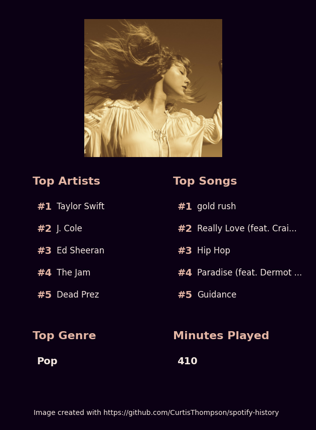

# Spotify History
This repository is for the analysis of Spotify streaming history files obtained from the Spotify website.


## Set-Up
1. Install Python (version 3 or greater)

2. Install the pipenv package with ```pip install pipenv```

3. Download your Spotify streaming data to the ```data/MyData/``` subdirectory

_To download your data, you must request the data from the [Spotify Account Privacy](https://www.spotify.com/uk/account/privacy/) page. You will then be sent a link to download the data. Note that this step can take a few days._

4. Obtain Spotify developer authorisation and store keys in ```data/api_keys/api_dev_keys.txt```

_Authorisation can be obtained by following [the steps listed on the Spotify website](https://developer.spotify.com/documentation/general/guides/authorization-guide/). Your two keys should be stored on separate lines within your text file._


## Usage
Before calculating any statistics, perform the set-up steps specified in the README. With this step, you should have your own Spotify streaming history to analyse. You should also be able to make Spotify API calls.

To calculate statistics, instantiate the ```StreamingHistory``` class with:

```from StreamingHistory import StreamingHistory```  

You can then call any methods from the class.

Alternatively, you can create all visualisations with the ```src/create_visualisations.py``` file.

1. ```cd src```

2. ```pipenv run python create_visualisation.py```

This file will be set up to run with the example data, so you will need to change the path to the data within the file.


## Contributing
1. Clone the repo and create a new branch

2. Make changes and test with ```data/ExampleData/StreamingHistory0.json```

3. Submit a Pull Request with description of changes

Where possible, please make sure that your changes conform to the [Style Guide for Python Code (PEP8)](https://python.org/dev/peps/pep-0008/).


## Example Visualisation


